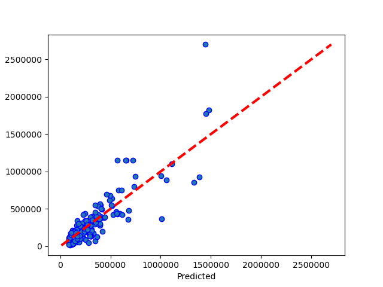
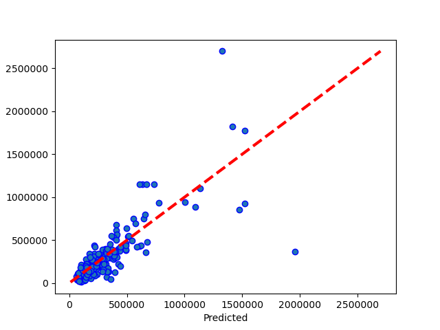

# Home-Price-Predictions-With-AutoML-and-SKLearn

## Data Source Overview

### Redfin
The Redfin dataset was pulled from Redfin’s website. It was filtered on single-family homes sold in Pittsburgh between 2017 and 2022. There are 1,592 houses and 27 features. Of the 27 features, 15 are numerical and 12 are categorical. Features utilized from Redfin were: 
* number of bedrooms
* number of baths
* square feet
* lot size
* binary flag of if a property has a HOA fee or not
* feature variable: price

### Census Bureau - American Community Survey 5 Year Estimates
The Census Data, specifically the American Community Survey 5-year Estimates (ACS) are pulled from the Census Bureau’s API. More detailed information about all of the 20,000 variables available for extraction is available here: https://www.census.gov/data/developers/data-sets/acs-5year.html. For this prediction task, all 20,000 variables were analyzed most the most relevant features were extracted. High level variable groups utlized were:
* population age
* median value of a property
* median rental value
* percent of people with commute less than 30 minutes
* percent of people with a STEM bachelors degree
* percent of people with an advanced degree (master, professional, doctorate)
* percent of people with income below $50K 
* percent of people with income above $150K
* inequality index 

## Modeling Approach

### AutoGluon - AutoML tool developed by Amazon
According to AutoGluon’s documentation for tabular prediction tasks, “AutoGluon can produce models to predict the values in one column based on the values in the other columns. With just a single call to fit(), you can achieve high accuracy in standard supervised learning tasks (both classification and regression), without dealing with cumbersome issues like data cleaning, feature engineering, hyperparameter optimization, model selection, etc.”  Before fitting the AutoGluon models, the data was transformed using a Yeo-Johnson transformer and subsequently standardized the data for the various machine learning algorithms.
*  Amazon. (n.d.). Tabular prediction. Tabular Prediction - AutoGluon Documentation 0.6.1 documentation. Retrieved December 14, 2022, from https://auto.gluon.ai/stable/tutorials/tabular_prediction/index.html 

Overall, the AutoGluon Ensemble model performed the best and had a testing: 
* RMSE of $143K
* MAE of $80K
* R^2 of 75%

The residual plot is pictured below: 

After filtering out high leverage points that drove errors higher, namely by filtering the results to instances where the empirical price is between $100K and $500K, the model obtained the following results:
* RMSE of $72K
* MAE of $57K
* R^2 of 46%

### Scikit Learn - GridSearch and Model Pipeline
Numerous Scikit Learn models were utilized in a pipeline and GridSearch was utilized to tune hyperparameters in an effort to obtain the highest performing model. The following models were evaluated:
* Ridge
* Lasso
* Decision Tree Regressor
* Random Forest Regressor
* Gradient Boosting Regressor
* MLP Regressor
* SGD Regressor
* Kernel Ridge
* Elastic Net

Overall, the Gradient Boosting Regressor performed the best and had the following testing results: 
* RMSE of $177K
* MAE of $87K
* R^2 of 62%

The residual plot is pictured below: 

Similar to the AutoGluon approach, filtering out high leverage points and leaving results between $100K and $500K left the model with the following testing results: 
* RMSE of $74K 
* MAE of 58K
* R^2 of 42%

### Other Considerations
A log of the independent variable, price, was also taken; however, this did not improve model performance. 
Other features were engineered, such as sqft per bedroom; however, this did not improve the model's performance. 

## Parting Thoughts
The goal of this project was to determine how much of an edge non-traditional data sources provides over characteristics of the home itself when predicting home prices. Overall, there is certainly room for improvement as the dataset was limited to Single-family homes and the city of Pittsburgh (the home of CMU).

Other predictive information, such as the pictures of the home on Redfin (interior, exterior, and satellite) as well as natural language processing on listing descriptions (for phrases such as “fixer-upper”) would be helpful for improving model performance. 

